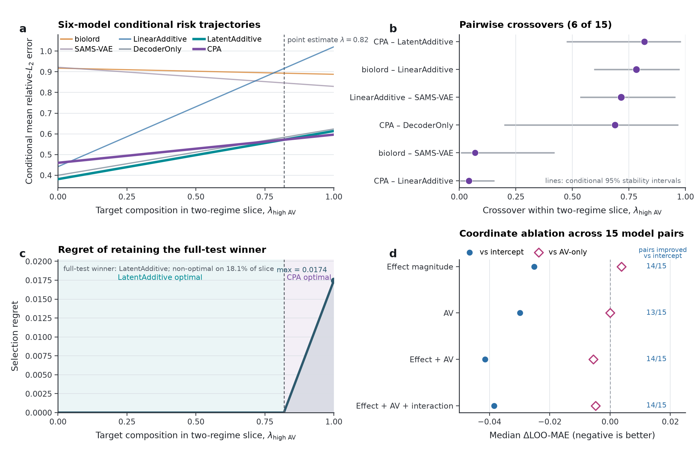

# Conditional perturbation benchmarking

[](https://github.com/Li-Hongmin/conditional-perturbation-benchmarking/actions/workflows/reproducibility.yml)
[](LICENSE)
[](DATA_LICENSE.md)

This repository provides a deterministic replay of a finite-benchmark analysis
that asks how the composition of cellular response regimes changes comparative
performance among single-cell perturbation predictors.

The replay starts from frozen, condition-level prediction metrics for six model
families evaluated on 46 held-out Norman combinatorial perturbations. It joins
post-inference response-regime annotations, collapses registered seeds at the
model level, and calculates:

- conditional risk curves over mixtures of high-additivity-violation-only and
  high-effect-only conditions;
- model winners and pairwise crossover locations;
- ranking stability and selection regret;
- finite-benchmark resampling-stability intervals;
- focal-seed, metric and response-geometry sensitivity analyses.

## Scientific boundary

This is a **post-result secondary analysis**, not a training repository. It
does not contain raw single-cell matrices, model implementations, checkpoints,
cloud locations or credentials. It does not reproduce model fitting, the
independent Wessels evaluation, or every figure and table in the associated
manuscript.

The resampling intervals describe stability within the frozen benchmark. They
are not population confidence intervals. The permutation outputs are
descriptive references, not retroactive hypothesis tests. The analysis does
not establish a universal model ranking, biological mechanism, cross-task
generality or prospective decision benefit.

## Repository contents

```text
crg/                 analysis implementation
configs/             frozen policy and public run identities
data/norman/         derived condition metrics and regime annotations
expected/            deterministic scientific-output checksums
scripts/             replay, verification and figure-building entry points
tests/               focused contract and determinism tests
DATA_DICTIONARY.md   column definitions, keys, units and missing-value rules
```

`data/norman/condition_metrics.tsv` contains 920 metric rows: 10 registered
runs, 46 conditions and two metrics. `data/norman/regime_manifest.csv` contains
the eight fields required for post-inference joining; internal source paths and
unused operational fields have been excluded from the public artifact.

## Representative output



The preview above is generated from the distributed condition-level tables by
`scripts/plot_benchmark_composition.py`. It shows the six-model conditional-risk
trajectories, the six pairwise crossovers observed among 15 comparisons, the
finite-panel regret of retaining the full-test-selected model and the
response-coordinate ablations. It is a visualization of the frozen replay, not
an additional dataset or independently estimated result.

## Reproduce the analysis

The frozen replay environment uses Python 3.11.14 and uv 0.11.16. Install
[uv](https://docs.astral.sh/uv/) before running the commands below.

```bash
uv sync --frozen --all-groups
uv run pytest -q
uv run python scripts/run_benchmark_composition.py \
  --repository-root . \
  --output-dir replay_outputs
uv run python scripts/verify_reproduction.py \
  --output-dir replay_outputs
uv run python scripts/plot_benchmark_composition.py \
  --input-dir replay_outputs \
  --output-dir replay_figure
uv run python scripts/verify_public_release.py
uv run python scripts/verify_release_manifest.py
```

The verification command requires exact SHA-256 agreement for all 11
scientific TSV outputs. `analysis_record.json` also records the producer commit,
software versions and operating system; it is therefore checked semantically
rather than required to be byte-identical across environments.
`RELEASE_FILE_MANIFEST.tsv` records the size and SHA-256 of every distributed
file except the manifest and its detached checksum.

## Data provenance

The condition identities originate from the Norman et al. combinatorial
Perturb-seq study (Science, 2019; GEO GSE133344; DOI:
[10.1126/science.aax4438](https://doi.org/10.1126/science.aax4438)). The
repository distributes only derived condition-level metrics and calibrated
annotations required for this replay; it does not redistribute the source
single-cell expression matrix.

Model execution used PerturBench from
[altoslabs/perturbench](https://github.com/altoslabs/perturbench) at commit
`4825e392294768da4b35561a76502c7006d6453e`. The exact Norman experiment
configuration paths, SHA-256 identities and frozen input hashes are recorded in
`UPSTREAM_PROVENANCE.md`; run-to-configuration hashes are retained in
`configs/public_run_registry_v1.yaml`. PerturBench source is BSD-3-Clause with
additional model-specific notices; no PerturBench implementation is vendored
here. The processed expression matrix and split are not redistributed.

The public run registry records the identities, model families, seeds and
configuration hashes of the completed runs whose condition-level outputs enter
the analysis. It is not a substitute for the omitted training code or
checkpoints. Historical `NM-` prefixes are retained as opaque frozen run
identifiers and do not indicate a journal-specific software dependency.

## Licensing and citation

Project source code is licensed under Apache License 2.0. Author-generated
derived tables and the generated figure preview are offered under CC BY 4.0 to
the extent that the author holds rights in them; upstream data remain subject
to their original terms. See
`DATA_LICENSE.md`, `THIRD_PARTY_NOTICES.md`, `SECURITY.md` and `CITATION.cff`.

## Contact

Hongmin Li — `lihongmin@edu.k.u-tokyo.ac.jp` —
[ORCID 0000-0003-0228-0600](https://orcid.org/0000-0003-0228-0600)
